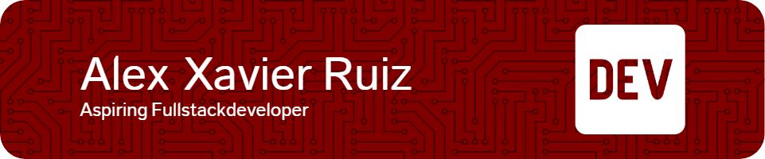

  

---

# 👋 Hi, I’m Alex Xavier Ruiz  
**Front-End Developer | Aspiring Full-Stack Engineer | TripleTen Software Engineering Student**

---

I’m a career-changer currently studying full-stack development through the TripleTen Software Engineering Program, with a strong focus on building clean, responsive, and accessible front-end interfaces using HTML, CSS, and JavaScript.

My background in customer service taught me how to deliver real value, and now I apply that mindset to code. While I’m strongest in front-end development, I’m actively expanding into the back end with Node.js, Express, and MongoDB to become a well-rounded full-stack engineer.

---

## 🚀 Featured Project

### 📸 [Spots – Responsive Social Media Photo App](https://alexxavierruiz571.github.io/se_project_spots/)
A cumulative front-end project showcasing:
- Semantic HTML and BEM-based CSS
- Responsive design using Flexbox and media queries
- Interactive modals and like buttons
- [🎥 Walkthrough Video](https://drive.google.com/file/d/1Q5FiMj5MiSts-u2yZ4Yis5umPeFqnsTx/view?usp=sharing)  
- [🖼️ Figma Design](https://www.figma.com/design/BBNm2bC3lj8QQMHlnqRsga/Sprint-3-Project--Spots?node-id=2-218&t=g0ymdBvPaXHeIC63)

---

## 💻 Technical Skills

- **Front-End:** HTML5, CSS3, BEM, Flexbox, Media Queries, Figma  
- **Version Control:** Git, GitHub  
- **Learning Now:** JavaScript, DOM, Events, Accessibility  
- **Up Next:** React, Node.js, Express, MongoDB

---

## 🎯 Goals

- Continue building real-world projects to strengthen my front-end foundation  
- Explore different areas of software engineering to find my best fit  
- Become confident in full-stack development using JavaScript, React, Node.js, and MongoDB  
- Stay consistent with learning and improving through hands-on experience  
- Land my first opportunity in the tech industry — whether it’s front-end, back-end, or full-stack

---

## 🧠 About Me

- Former full-time retail rep, now focused on software engineering  
- Strong communicator and visual thinker with an eye for UI detail  
- Passionate about learning by building real-world projects  
- Dedicated to becoming a **full-stack developer** capable of owning front-to-back user experiences

---

## 📍 Location  
United States (EST) – Open to remote, internships, and junior dev opportunities

---

## 📫 Let’s Connect  
- [GitHub](https://github.com/alexxavierruiz571)  
- [LinkedIn](www.linkedin.com/in/alex-ruiz-291a29373)  
- Email: ruiz.xavier@ymail.com
